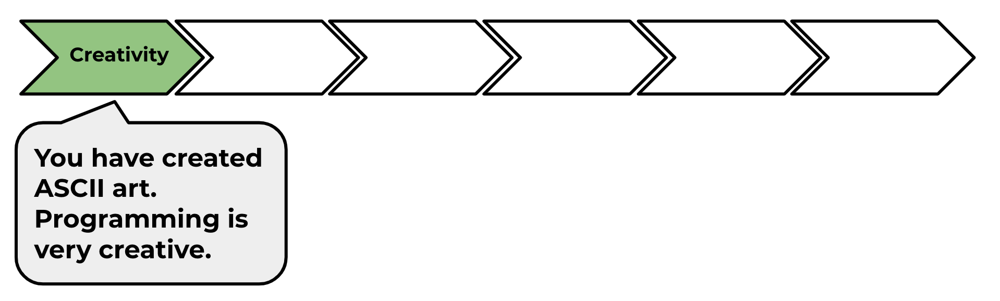

--- challenge ---
## Challenge: calculating text
Did you know that you can also calculate text?!

What will the following program print to the screen? See if you can guess it correctly before running the program.

Can you make up any words of your own? You could even make your own patterns!

Go to the next project in the module pathway: 'Rock, Paper, Scissors'.

--- /challenge ---

Click on the 'Click me' button to try the next project:

<a href="https://codeclub.org/en/python1">

